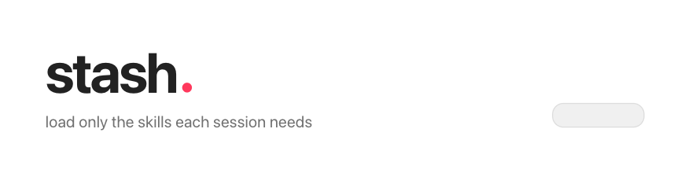

<picture>
  <source media="(prefers-color-scheme: dark)" srcset="docs/assets/stash-header-dark-animated.png">
  
</picture>

# stash

**Per-project skill manager for Claude Code.** Load only the skills each
session needs - organize hundreds of Claude Code skills into domain profiles,
scope them per project, and keep every loaded skill's description intact.


```
skills-profile  ~/my-trading-project   [space] toggle  [l/h] open/close  [enter] apply

 - [x] trading            79 skills
       [x] vcp-screener
       [x] backtest-expert
       [x] cot-contrarian-detector
 + [x] investing          41 skills
 + [x] research           14 skills
 + [ ] marketing          50 skills
 + [ ] hr                  4 skills
 + [ ] business-clevel    66 skills
```

One `enter` later: links applied, `claude` launches with 134 skills instead of 590.

<!-- HERO GIF: vhs recording of `skills-profile pick` replaces the block above at launch -->

## The problem: Claude Code context bloat

Claude Code loads **every skill in `~/.claude/skills/` into every session** -
and the skill listing has a token budget (about 1% of the context window).
Past it, descriptions get truncated and the overflow shows **name-only**. A
name-only skill barely auto-triggers: Claude cannot match "analyze my churn" to
`churn-prevention` without its description. Installing more skills silently
makes ALL your skills trigger worse. Deleting skills you paid tokens to find is
not a fix - loading them per project is.

## 30-second start

```bash
git clone https://github.com/grooverLab/stash
cd stash && ./install.sh

skills-profile migrate --dry-run   # preview organizing your flat skills dir
skills-profile migrate             # do it (real dirs stay global, untouched)

cd ~/my-project
skills-profile pick                # choose skills; claude launches lean
```

## What it does

| Command | Effect |
|---|---|
| `pick` | terminal TUI - collapsible tree, toggle a whole profile or a single skill |
| `pick-html` | the same picker in your browser (bash-generated page + one-shot `nc`) |
| `use` / `off` | scriptable: `skills-profile use trading db`, `skills-profile off marketing` |
| `list` / `status` | profiles with counts / this project's live selection |
| `migrate` | one-time: route the flat global dir into domain profiles, preview first |
| `update` | git-pull every vendored skill repo - all projects see new content instantly |

All selection paths converge on one diff engine: add what you checked, remove
what you unchecked, never touch a real file, never overwrite an existing name.

## The model

```
~/.claude/skill-profiles/     the warehouse - loads nowhere by itself
  trading/  marketing/  db/...    (symlinks into your vendored skill repos)
~/.claude/skills/             global - only what you want in EVERY session
<project>/.claude/skills/     per-project - the symlinks stash manages
```

A skill loads if it sits in the global dir or the project dir. That is the
whole mechanism - two shell scripts moving symlinks, no daemon, no database,
no LLM. Selection state (`.claude/skills-profile.json`) is a plain-JSON cache,
always recomputed from the links; the links are the truth.

## Skill sources it manages

| Source | How |
|---|---|
| Vendored git repos (skill packs) | clone once into `~/.claude/vendor/`, symlink skills into profiles |
| Bare `SKILL.md` folders | symlink the folder into any profile |
| Existing flat `~/.claude/skills/` | `migrate` routes symlinks into profiles; real dirs stay global |
| Claude Code plugins | not managed - plugins keep their own marketplace + auto-update; the two compose |

## Updates

Nobody else states this plainly, so: **everything is symlinks, so there is
nothing to re-install.**

- `skills-profile update` git-pulls every repo in `~/.claude/vendor/`. The
  warehouse and every project that links those skills see the new content the
  moment the pull finishes.
- The `stash` commands themselves are symlinks into this repo - `git pull`
  here updates them instantly.
- Claude Code plugins are outside stash and keep auto-updating via their own
  marketplaces.
- Selection changes need a session restart: the skill list is read once at
  session start. `claude -c` resumes your conversation with the fresh scan.

## Limits, stated plainly

- macOS out of the box; Linux needs `openbsd-netcat` for the browser picker
  (the TUI and CLI need nothing).
- `migrate`'s routing rules ship tuned for the author's vendors - edit
  `profile_for()` in `bin/skills-profile` for yours, or build profiles by hand:
  `mkdir -p ~/.claude/skill-profiles/mydomain && ln -s /path/to/skill ...`
- Plugins are deliberately out of scope today (their system already handles
  scoping via `enabledPlugins` and updates via marketplaces).
- After applying, pickers launch `claude --dangerously-skip-permissions`. Set
  `SP_CLAUDE_FLAGS` to override (set it empty for a plain `claude`).

Built by [grooverLab](https://github.com/grooverLab) after installing 590
skills in one week and watching every session pay for all of them.

## FAQ

**How do I stop Claude Code loading all my skills?**
Move them into stash profiles (`skills-profile migrate`), then select per
project with `skills-profile pick`.

**How do I disable Claude Code skills for one project only?**
Uncheck them in `pick`, or `skills-profile off <profile>`. Links are removed
from that project only - every other project keeps its own selection.

**Why do some skills show name-only, with no description?**
The skill listing's token budget truncates descriptions past ~1% of context.
Name-only skills barely auto-trigger. A lean per-project list keeps every
loaded skill fully described.

**Does this work with plugin skills?**
Plugins are managed by Claude Code's plugin system and keep auto-updating;
stash manages directory skills. They compose without conflict.

**Do I need to restart Claude Code after changing the selection?**
Yes - the list is read once at session start. `claude -c` resumes the same
conversation with the fresh selection.

**Can teammates share a selection?**
`.claude/skills-profile.json` is committable; links point into your home dir,
so teammates run `skills-profile use` themselves. Keep `.claude/skills/` in
`.gitignore`.

## Docs

- **[Interactive overview](https://grooverlab.github.io/stash/)** - the big
  loop with in-place drill-down flowcharts, light + dark
- **[Audit flowcharts](https://grooverlab.github.io/stash/flowchart.html)** -
  every code path charted, zoom + pan, findings history

## Uninstall

```bash
./uninstall.sh   # removes two symlinks in ~/.claude/bin - nothing else
```

Profiles, project links, and state files are your data and survive.

## Contributing & License

Issues and PRs welcome. [MIT](LICENSE).
